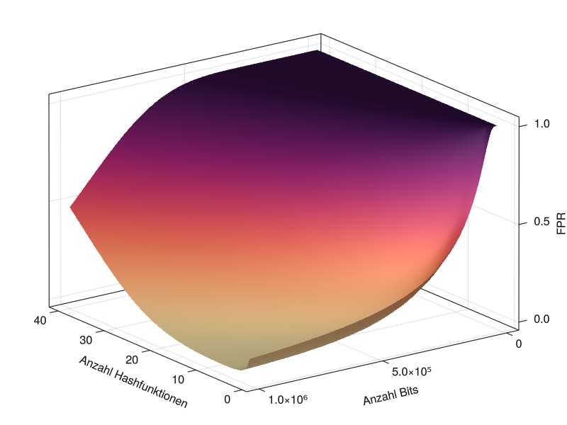
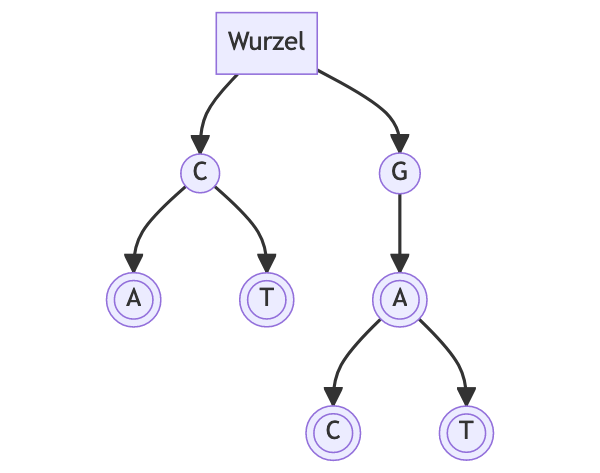
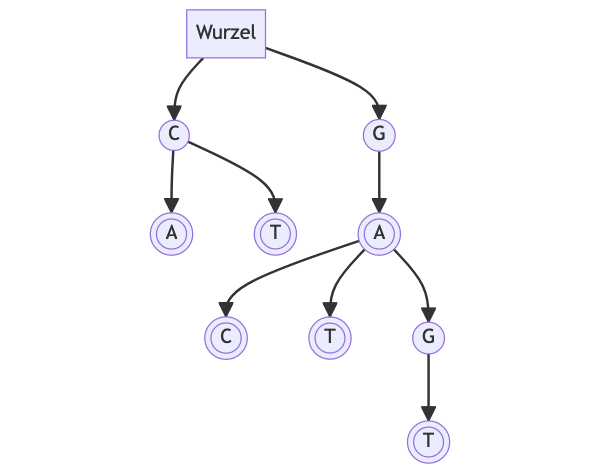

[](https://classroom.github.com/a/BiinX9CG)
[](https://classroom.github.com/open-in-codespaces?assignment_repo_id=19767706)
# Übung 4: Suchen Und Finden
Pro Übung gibt es 20 Punkte. Für die Zulassung zur Prüfung müssen in allen Übungen mindestens 50% der Punkte insgesamt sowie mindestens 25% in jeder einzelnen Übung erzielt werden.

Der Code für diese Aufgabe kann als Repository geklont und lokal kompiliert werden. Es ist dafür nötig, die Git submodules zu initialisieren und zu updaten: `git submodule update --init`. Anschließend kann `make tests` im .vscode-Ordner ausgeführt werden, um die Tests zu kompilieren.

## Einleitung

Wie Sie in der VL kennen gelernt haben ist wiederholtes Suchen, meist um Schlüssel-Wert Paare zu finden, manchmal um Set-Membership zu testen, ein häufig anzutreffendes Problem. 
In dieser Übung wollen wir einen solchen Anwendungsfall auf einem realistischen Datensatz abbilden.
Konkret geht es um die Analyse eines menschlichen Chromosomes.

Dazu haben wir Ihnen in `data/Homo_sapiens.GRCh38.dna.chromosome.Y.fa` das Menschliche Y Referenzchromosom des [Human Genome Projects](https://www.sanger.ac.uk/resources/downloads/human/) zur Verfügung gestellt.
Das Chromosom enthält rund 58.2M Einträge an Basenpaaren. Es gibt 5 mögliche Zeichen die jeder Eintrag annehmen könnte (CGATN). 
Eine wiederholte sequentielle Suche erscheint auf den ersten Blick höchst ineffizient und langsam.
Ein kurzer Test auf der Kommandozeile zeigt allerdings:

```shell    
> time cat data/Homo_sapiens.GRCh38.dna.chromosome.Y.fa | tr -d '[:space:]' > concated.txt 
cat data/Homo_sapiens.GRCh38.dna.chromosome.Y.fa  0.00s user 0.02s system 0% cpu 2.365 total
tr -d '[:space:]'  2.35s user 0.01s system 99% cpu 2.368 total
> time grep -q TTTCCCCTATTCM concated.txt
grep 0.61s user 0.02s system 99% cpu 0.634 total
```

Eine einzelne Suche braucht, im Worst Case, nur $0.61s$ (M1 Mac). Wenn es also um die Beantwortung einer einzelnen kurzen Frage über die Daten geht ist lineares Suchen durchaus eine Option.
Hierbei ist allerdings zu beachten das die Suche in Ihrer Laufzeit immer in $O(s\cdot n)$ liegt, wobei $s$ für die Anzahl der Suchbegriffe und $n$ für die Größe der zu durchsuchenden Datei steht. 
Für eine Suchmenge von 500 Anfragen würde die Suche also schon rund __5__ Minuten dauern. 
Das geht besser.
Gerade wenn wiederholt in den Daten gesucht werden soll, oder wenn viele Nutzer auf den selben Daten suchen wollen kann es sich also durchaus lohnen die Suche in eine dafür geeignete Datenstruktur zu überführen.
Wir werden in dieser Übung zwei solcher Strukturen betrachten.

## Aufgabe 1: Bloom Filter

 

> Dateien die in dieser Aufgabe editiert werden sollen:
> - `BloomFilter.h`
> - `hash.h`
> - `bloom_cli.cpp`

Sie implementieren in dieser Aufgabe einen generischen Bloom-Filter, welchen Sie bereits in der Vorlesung kennengelernt haben. Mit Hilfe des Bloom-Filters werden Sie die Anzahl von einzigartigen Zeichenketten (von fester Länge) im menschlichen Y-Chromosom abschätzen.
Die Besonderheit hierbei ist das der Bloom Filter unser Zählvorhaben mit deutlich weniger Speicheraufwand abbilden kann als eine äquivalente Symboltabelle.
Dabei bleibt der Bloom Filter zusätzlich eine schnellere Option im Vergleich zu wiederholtem sequenziellen Suchen.

Der Bloom-Filter soll die folgenden Operationen unterstützen:
- `add(item)`: Fügt das Element `item` dem Bloom-Filter hinzu.
- `contains(item)`: Überprüft, ob das Element `item` möglicherweise im Bloom-Filter enthalten ist.
- `fill_ratio()`: Gibt den Befüllungsgrad des Bloom Filter zurück (d.h. die Summe der gesetzten Bits im Bloom Filter geteilt durch die Größe des Filters).

Der Bloom-Filter soll die folgenden Eigenschaften aufweisen:
1. Der Filter soll eine konfigurierbare feste Größe $m$ haben. 
2. Der Filter soll eine einstellbare Anzahl $k$ von Indizes pro Element unterstützen.
3. Der Filter soll nicht auf einen bestimmten Datentyp beschränkt sein und generisch implementiert werden.
4. Der Filter soll unabhängig von der verwendeten Schlüsselfunktion sein. Die übergebene Schlüsselfunktion wird ein Array von $k$ Hashes vom Typ `long` zurückgeben, die dann zur Berechnung der Indizes im Bloom-Filter verwendet werden sollen.

Um eine austauschbare Schlüsselfunktion zu implementieren, empfiehlt sich die Verwendung der `std::functional`-Bibliothek sowie (ggf.) von [Closures](#closures-in-c). 
Dadurch können Sie die Schlüsselfunktion zur Compilezeit oder Laufzeit austauschen und den Bloom-Filter für verschiedene Datentypen und Anwendungsfälle anpassen.

Sie werden eine solche Schlüsselfunktion verfassen. Dafür gibt es verschiedene Ansätze, die alle das Ziel haben, unterschiedliche Hashes für denselben Schlüssel zu erzeugen. 
Es ist wichtig, dass die generierten Hashes möglichst gleichverteilt sind. Um Ihnen die Aufgabe zu erleichtern, geben wir Ihnen hier einige Ansätze, die sich für Bloom-Filter bewährt haben. Es steht Ihnen jedoch frei, auch einen eigenen Algorithmus für die Schlüsselgenerierung zu erstellen. 
Ob Ihre Methode gut funktionieren würde, können Sie anhand des Testergebnisses des Tests `A1.1` sehen. In diesem Test wird überprüft, ob Ihre Hashfunktion ungefähr gleichverteilte Werte generiert (dies ist jedoch kein Bewertungskriterium).

Die Ansätze sind wie folgt:
- Generieren Sie mehrere Hashes, indem Sie den Hashwert wiederholt hashen. Das bedeutet, dass der $k+1$-te Hashwert der Hash des $k$-ten ist. Dieser Ansatz ist relativ einfach umzusetzen.
	- Die Wahl der Hashfunktion ist Ihnen freigestellt.
	- Dieser Ansatz erfordert _nicht_, dass sie Closures nutzen (da sie die Funktion selbst übergeben können)
- Generieren Sie mehrere Hashes, indem Sie basierend auf dem Multiplikativen Hashing eine Funktion schreiben, die mit $k$ verschiedenen Multiplikatoren multipliziert. Dieser Ansatz erfordert etwas mehr Aufwand.
	- Dieser Ansatz erfordert _nicht_ das sie Closures nutzen (da sie die Funktion selbst übergeben können)
- Generieren Sie mehrere Hashes, indem Sie basierend auf dem Multiplikativen Hashing eine Funktion schreiben, die mit $k$ verschiedenen Multiplikatoren multipliziert und dabei nur Primzahlen als Multiplikatoren nutzt. Dieser Ansatz ist anspruchsvoll.
	- Hinweis: Sie könnten einen Array von $k$ Multiplikatoren vorberechnen und eine Funktion verfassen, die eine Closure zurückgibt, die diese  Multiplikatoren "captured".
	- Dieser Ansatz erfordert _wahrscheinlich_ die Nutzung von Closures.

	```cpp
	std::function<std::array<long>(const T &el)> make_f(){
		std::array<int,k> multiplier;
		return [&multiplier](const T &el){...}
	}
	```

### Closures in C++

> Eine `closure` ermöglicht es Ihnen, eine C++-Funktion als Objekt zu behandeln.
> Sie entspricht einer anonymen Funktion in JavaScript oder einem `lambda`-Ausdruck in Python.

Eine Closure ist eine Funktion, die auf Variablen aus dem umgebenden Kontext zugreifen kann, auch wenn diese außerhalb des Gültigkeitsbereichs der Funktion liegen. Mit einer Closure können Sie Funktionen als Argumente an andere Funktionen übergeben oder sogar Funktionen als Rückgabewerte zurückgeben.

Hier ist ein Beispiel für eine `closure`, die zwei `int`-Argumente addiert:

```cpp
??? add = [](int a, int b){
	return a+b;
}
```

In diesem Beispiel sind `a` und `b` die Argumente, die bei Aufruf der Funktion verwendet werden. Die Funktion selbst kann wie gewohnt mit `add(2, 3)` aufgerufen werden.

Nun stellt sich natürlich die Frage welchen Typ eine Funktion hat. 
Die Standardbibliothek von C++ stellt den Template-Typ `std::function` im Header `<functional>` bereit, um den Typ einer Funktion zu definieren. Dabei müssen Sie den Rückgabetyp sowie die Typen der Argumente im Template spezifizieren. Für unsere `add`-Funktion würde das wie folgt aussehen:

```cpp
std::function<int(int,int)> a = [](int a, int b){
	return a+b;
}
```

Alternativ können Sie auch das Schlüsselwort `auto` verwenden:

```cpp
auto a = [](int a, int b){
	return a+b;
}
```

Eine weitere Besonderheit ist das sogenannte "capturing" von Variablen, das der Closure ermöglicht, auf Variablen zuzugreifen, die außerhalb des Scopes der Funktion liegen. Hier ein Beispiel:

```cpp
#include <iostream> 
#include <functional> 
int main() { 
	int factor = 2; // A variable to capture in the closure 
	// Create a closure that multiplies an integer by the captured factor 
	auto multiply = [factor](int num) { return num * factor; }; 
	// Call the closure 
	int result = multiply(5); 
	std::cout << "Result: " << result << std::endl; return 0;
}
```

Es ist auch möglich, Container per Referenz zu erfassen, indem man `[&arr](int a, int i)...` verwendet.

__Aufgabe 1.1: (2p):__ Erstellen Sie einen der beschriebenen Ansätze für die Schlüsselfunktion in `hash.h` in der Funktion `hash_key`.

__Aufgabe 1.2 (4p):__ Vervollständigen Sie die `BloomFilter`-Klasse in `BloomFilter.h` sodass sie die im Text beschriebenen Eigenschaften erfüllt.

__Aufgabe 1.3 (2p):__ Zählen Sie die Anzahl einzigartiger Zeichenketten mit einer Länge von _12_ in der Datei `data/Homo_sapiens.GRCh38.dna.chromosome.Y.fa`, verfassen Sie dazu in `bloom_cli.cpp` eine `main` Funktion welche eine Datei Zeichen für Zeichen liest und in einen Bloom Filter einfügt. Das Script soll die Anzahl der einzigartigen Zeichenketten der Länge _12_ ausgeben.
Der Pfad der zu verarbeitenden Datei soll das erste Kommandozeilenargument sein.
Ignorieren Sie Zeilenumbrüche und andere Whitespace-Character. Versuchen Sie die Falsch-Positiv-Rate kleiner als "1 aus 10.000" zu halten (die Wahrscheinlichkeit für ein falsch positives Ergebnis sei $P(FP|x)=10^{-5}$).

> Hinweis: Sie können zur Berechnung der Kenngrößen für den Bloom Filter [hier](https://hur.st/bloomfilter/) Hilfe finden.

> Hinweis: Die Referenzimplementierung benötigt etwa 64s zur Verarbeitung des Genoms. Messen Sie doch auch Ihren Ansatz mal mit Hilfe des `time` Kommandos in bash (Linux / Mac).

> Hinweis: Die CLI Programme können mit Make (wie auch die Tests) compiled werden indem `make all` ausgeführt wird. 

## Aufgabe 2: BST Erweiterung

> Dateien die in dieser Aufgabe editiert werden sollen:
> - bst.h (aus VL)

__Aufgabe 2.1 (4p):__ 
Modifizieren Sie die Implementierung des Binary Search Trees gegeben in `bst.h` so, dass Duplikate von Schlüsseln eingefügt werden, anstatt ignoriert. 
Bei Abfrage `get_all()` des Schlüssels geben Sie dann _alle_ mit dem Schlüssel assoziierten Werte zurück. 
Bei Löschung `remove_all()` eines Schlüssels entfernen Sie _alle_ Einträge für den Schlüssel.
Für die beiden Funktionen `get` sowie `remove` des BST können Sie frei entscheiden welches der mehrfachen Elemente zurück gegeben werden sollte.

## Aufgabe 3: Substring-Search with Trees

> Dateien die in dieser Aufgabe editiert werden sollen:
> - trie.h
> - trie_cli.cpp

Wir können unsere Suche, sowohl in Laufzeit als auch Platzverbrauch, verbessern indem wir eine _noch_ mehr auf die Problemstellung zugeschnittene Datenstruktur nutzen.
Diese Struktur basiert ebenfalls auf Bäumen und ist spezifisch für unsere Suchanwendung gedacht.
Bei Betrachtung der Daten fällt auf das die validen Elemente unserer zu durchsuchenden Sequenz nur _genau_ 5 bestimmte sein können: G,C,A,T und N.
Was wenn wir nun also einen Wald, also eine Menge von Bäumen, konstruieren der genau diese Abfolgen abbilden könnte?
Die Datenstruktur die wir betrachten werden wird [Trie](https://de.wikipedia.org/wiki/Trie) genannt, manchmal auch _Präfixbaum_:



Dieser Beispiel-Trie repräsentiert die Worte: `GA, GAC, GAT, CA, CT`. Beobachtete Worte werden basierend auf ihrem gemeinsamen Präfix zusammengefasst und Nodes die am Ende eines beobachteten Strings im Baum liegen werden markiert (man beachte hier insbesondere den nicht-Blattknoten "A" welcher aber dennoch als Ende einer Zeichenkette markiert wird).
Wir werden den Trie nutzen um das gegebene Genom zu verarbeiten und zu Testen welche der Einträge aus `data/genome_substr.csv` enthalten sind. 

Ein weiterer Vorteil: wenn wir unser Genom verarbeitet haben und alle Zeichenfolgen der Länge $k$ verzeichnet haben, können wir nicht nur nach diesen Suchen sondern bekommen die Suche nach Teilzeichenfolgen kostenlos dazu, da unser Wald nur Pfade enthält die tatsächlich in den Daten beobachtet wurden.
So könnten wir in unserem Beispiel-Trie ebenfalls nach Zeichenketten der Länge 1 suchen, auch wenn beim erstellen diese nicht explizit betrachtet wurden.

Ein Trie besitzt folgende Operationen: `add`, `contains` sowie `observed`.
Wobei `add` dem Trie eine Zeichenfolge hinzufügt, `contains` prüft ob die Zeichenfolge enthalten ist, und `observed` prüft ob die Zeichenfolge enthalten ist __und__ das Ende einer Zeichenfolge darstellt.

Zusätztlich besitzt ein Trie einige Eigenschaften die ihn von einem BST unterscheiden:
- Ein Trie ist über ein Alphabet definiert. Alphabet meint die gültigen Elemente welche eine Zeichenfolge (im weiteren Sinne) bilden.
	- Eine Zeichenfolge $Z$ könnte auch ein array von Bits sein: `[0,1,0,0,0,1]`, bei einem Alphabet von `{0,1}`
	- Eine Zeichenfolge muss _nicht_ eine konstante Länge aufweisen.
		- Ihre Implementierung soll diese Interaktion möglichst unterstützen.
		  Hinweis: einzelne Funktionen in einer Klasse können mit einem zusätzlichen size-Template versehen werden. 
- Ein Trie ist ein _Wald_ aus _Bäumen_, wobei jeder Knoten potentiell so viele Kindknoten hat wie es Elemente im Alphabet gibt.
	- Um die Implementierung zu erleichtern gibt es eine Wurzel die die Bäume vereint aber nie Teil der Zeichenketten ist.

Der Ablauf für `add` wenn wir in unseren Beispiel-Trie das Wort `GAGT` einfügen ist wie folgt:
- Wir starten bei der Wurzel und Traversieren den Trie indem wir dem Pfad für `G` folgen, welcher schon existiert. 
- Vom Knoten `G` folgen wir dem Pfad zu Knoten `A`, welcher existiert.
- Vom Knoten `A` folgen wir dem Pfad zu Knoten `G`, welcher noch nicht existiert. Wir fügen daher einen neuen Knoten `G` als Kind von Knoten `A` ein.
- Vom neuen Knoten `G` folgen wir dem Pfad zu Knoten `T`, welcher noch nicht existiert. Wir fügen daher einen neuen Knoten `T` als Kind von Knoten `G` ein.
- Da wir das Ende der Zeichenkette erreicht haben, markieren wir den zuletzt besuchten Knoten als Ende einer Zeichenkette.

Nach der `add` Operation sieht unser Trie wie folgt aus:



Die `contains` und `observed` Operationen traversieren beide jeweils den Pfad den die gegebene Zeichenkette beschreibt. Sollte ein Pfad ungültig sein, also der nächste Knoten nicht existieren oder ein Zeichen außerhalb des Alphabets enthalten sein, geben die Operatoren `false` zurück. 
Sollte der Pfad den die Zeichenkette beschreibt erfolgreich traversiert werden so gib `contains` `true`zurück, während `observed` nur dann `true` zurück gibt, wenn der letzte Knoten im Pfad als Ende einer Zeichenkette markiert ist.
Beispiele für unseren Beispiel-Trie:
Für `GAGT` würde `contains` und `observed` also `true` zurück geben.
Für `GAG` würde `contains` `true` zurück geben aber nicht `observed`.
Für `GAM` würden beide Operatoren `false` zurück geben da ein nicht im Alphabet enthaltenes Element in der Zeichenkette enthalten ist.

Da die Umsetzung eines Tries relativ komplex ist sind in dem Klassengerüst einige tiefere Hilfestellungen als gewöhnlich gegeben. Weiterhin ist durch das Testing eine Anforderung an die Implementierung mit `std::array`s von Key-Elementen als Eingabe umgehen zu können.

__Aufgabe 3.1 (6p):__ Implementieren Sie den Trie, mit seinen Operationen, in `trie.h` wie oben Beschrieben.

__Aufgabe 3.2 (2p):__ Verwenden Sie Ihre Trie-Implementierung, um zu überprüfen, welche Zeilen aus der Datei `data/genome_substr.csv` im Referenzchromosom enthalten sind. Implementieren Sie ein Skript in der Datei `trie_cli.cpp`, das die beiden Dateipfade als Kommandozeilenargumente entgegennimmt, wobei der Pfad der zu durchsuchenden Datei das _erste_ der beiden Argumente ist. Geben Sie für jede Zeile in der Datei `data/genome_substr.csv` auf stdout eine 0 für "nicht enthalten" oder eine 1 für "enthalten" aus, jeweils in einer eigenen Zeile.

> Hinweis: Die Referenzimplementierung benötigt etwa 72s zur Beantwortung der Frage. Messen Sie doch auch Ihren Ansatz mal mit Hilfe des `time` Kommandos in bash (Linux / Mac).

> Ihre Ausgabe sollte also so aussehen:
>
> ```console
> > ./out/trie_cli data/Homo_sa.... data/genome_substr.csv
> 0
> 1
> 0
> ...
> ```
